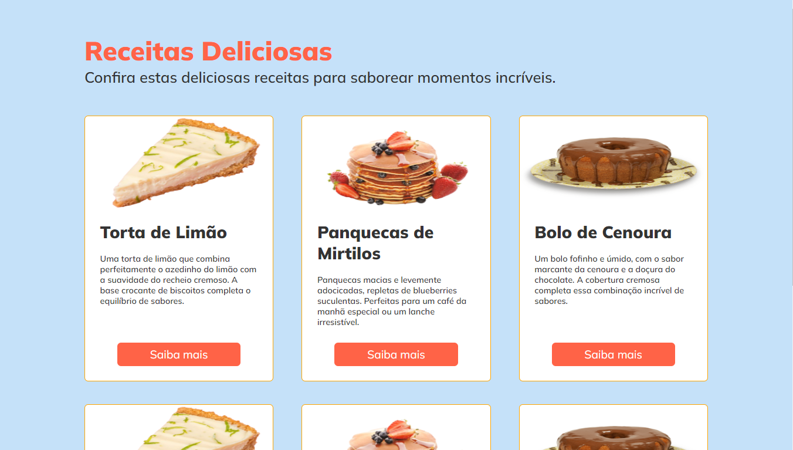

# 🍰 Receitas Deliciosas

## **📝 Descrição**

Este é um projeto de Receitas Deliciosas desenvolvido durante a trilha Explorer da plataforma Rocketseat. Ele apresenta uma página web com diversas receitas, cada uma com sua imagem, título e uma breve descrição.

## **💻 Tecnologias Utilizadas**

- HTML5
- CSS3

## **🎓 Aprendizados Destacados**

### **📚 Estruturação HTML**

- **Tags Semânticas:** Uso apropriado de tags semânticas como `<header>`, `<main>`, `
`, ``, `<h2>`, `
`, e `<button>` para criar uma estrutura clara e compreensível.
- **Organização dos Elementos:** Separação e organização dos elementos para facilitar a manutenção e compreensão do código.

### **🎨 Estilização com CSS**

- **Layout e Estilo:** Definição de estilos para os elementos da página, incluindo cartões de receitas, imagens e botões.

### **📱 Responsividade**

- **Layout Responsivo:** Adaptação do layout para diferentes tamanhos de tela, proporcionando uma experiência consistente em dispositivos variados.

### **👍 Boas Práticas**

- **Organização do Código:** Estruturação e organização do código HTML e CSS para facilitar a manutenção e compreensão.
- **Acessibilidade:** Aplicação de boas práticas de acessibilidade, como o uso de texto alternativo para imagens (`alt=""`).

Este projeto demonstra conceitos fundamentais de HTML e CSS, oferecendo uma experiência simples para visualização de receitas. Pode ser expandido para adicionar mais funcionalidades e aprimoramentos visuais, proporcionando uma base sólida para o desenvolvimento web.

---

Desenvolvido por João Gabriel | [Linkedin](https://www.linkedin.com/in/jgabriel522/) | 17/12/2023
